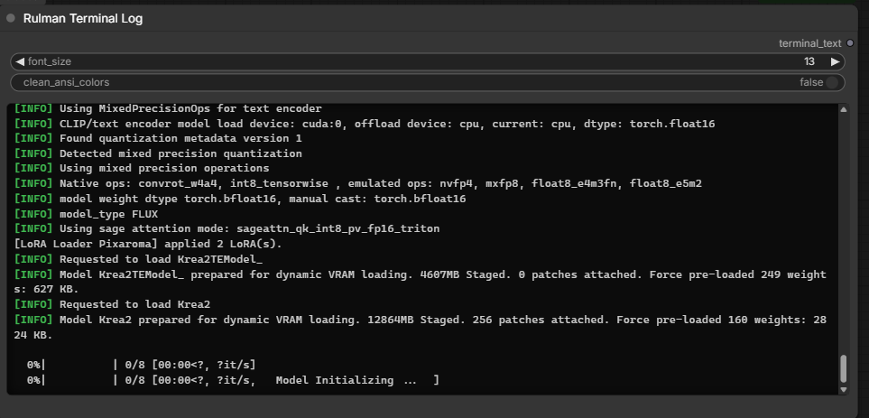

# Rulman Terminal Log

Displays terminal and log output directly inside a ComfyUI node, allowing you to monitor the console without switching between ComfyUI and the terminal window.

The node is useful when working with long-running or resource-intensive processes where terminal output is important for monitoring progress, status messages, warnings, and errors. Keeping the console output directly on the ComfyUI canvas helps save screen space and avoids constantly moving or resizing the terminal window.

The node is lightweight and designed to use minimal system resources. It provides an adjustable font size and optional ANSI color handling, allowing the displayed output to be adapted to your workspace.

The goal is simple: keep the information you normally need from the terminal available directly inside ComfyUI, without adding unnecessary overhead or complexity.

## Installation

Open a terminal in `ComfyUI/custom_nodes/` and run:

    git clone https://github.com/Sergeypruddkyi/ComfyUI-Terminal-Log.git

Restart ComfyUI and refresh the browser with `Ctrl + F5`.

No additional dependencies required.